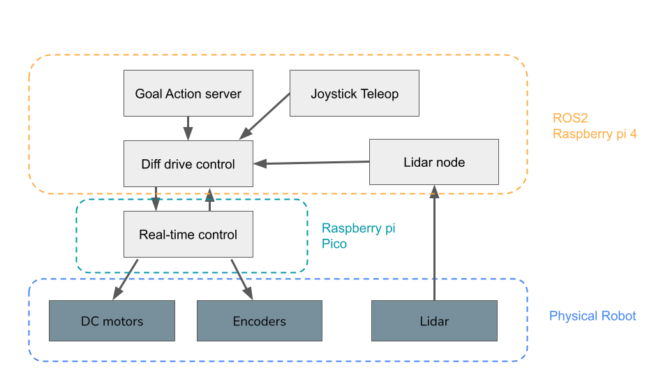
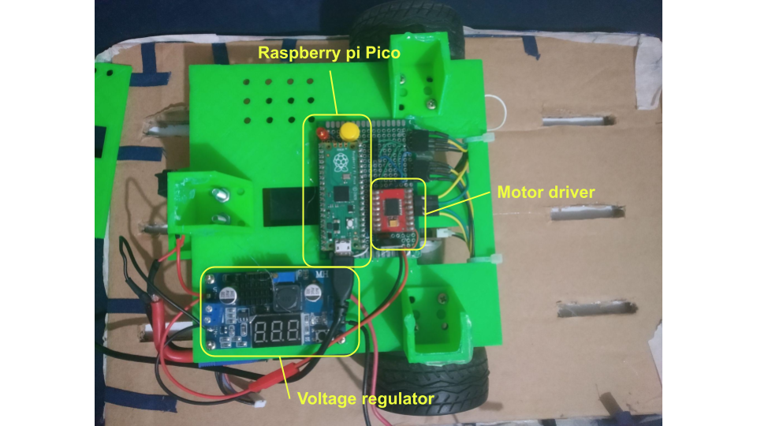
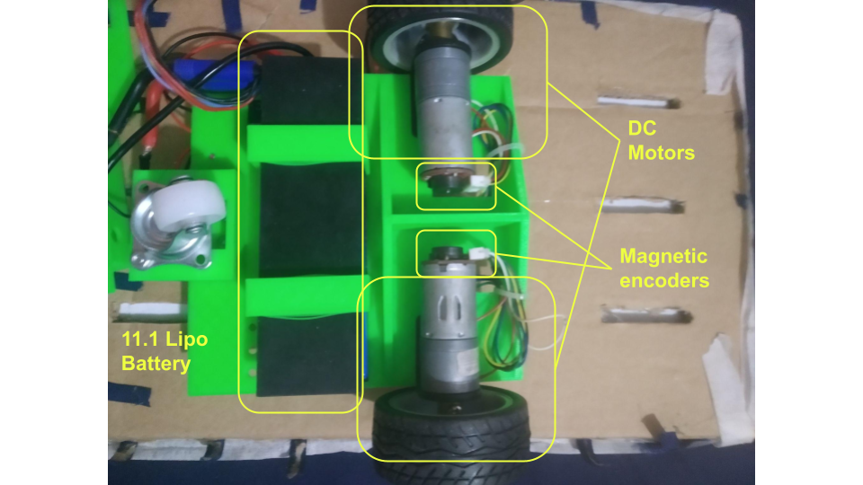
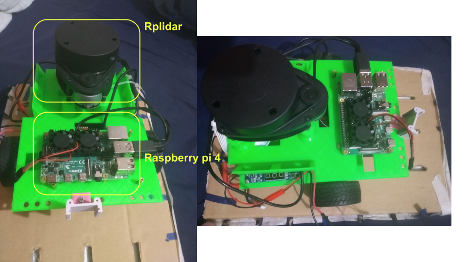
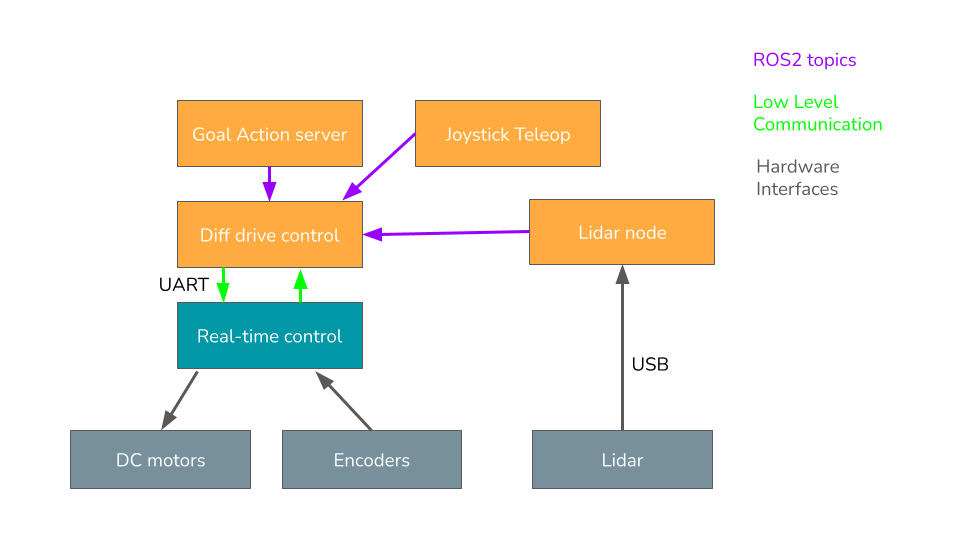
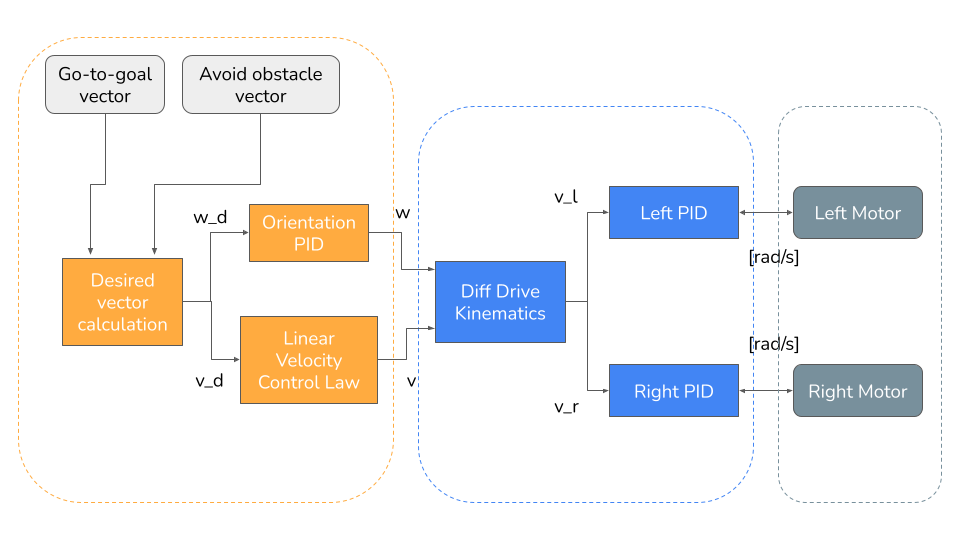

# rpi robot ros2 packages

> This project is part of the subject "Autonomous Mobile Robots - SSC5888", Sao Paulo University - PPG CCMC. 

> Student: Jose Eduardo Laruta Espejo

> Professor: Fernando Santos Osorio PhD.

This repo has all the ros2 packages needed for running a reactive navigation system based 
on feedback control. 

## Robot architecture

The robot is organized in a layered architecture in which the low level and hardware interface is implemented
in an embedded system which has the responsibility of real-time control, this low level interface is controlled by a 
microcontroller (Raspberry pi Pico). Then, the high level control is implemented using ROS2 Foxy through different packages, nodes
and launchfiles. This high level control is running on a Raspberry Pi 4 single board computer.

### Robot hardware
The robot was built using two main computing plaforms for different cases:

  1. **Real-Time control**: This part was implemented in a Raspberry pi Pico Microcontroller. The microcontroller is in charge of interfacing with the DC motors for traction through a motor driver, it uses PWM signals and digital I/O for this. Also, the microcontroller reads the pulses from the two magnetic incremental encoders. With this pulses and a kinematic model, the odometry of the robot is computed. Then, the microcontroller also implements a simple serial interface for receiving velocity commands and sending the odometry information back.
  
  
  All the firmware and low level code was made using C++ with the official Raspberry pi Pico SDK. The code for this module can be found in this [repo](https://github.com/tabris2015/differential-drive-rpi-pico)

  2. **High Level control**: The high level control was implemented in a Raspberry pi Single board computer with the needed compute capabilities for running a full fledged linux distribution (Ubuntu 20.04) and the base ROS2 stack (Foxy). The computer is connected to a RPlidar sensor through USB and to the microcontroller to USB with a virtual serial port.
  

Relative to other hardware aspects, a single 11.1V lipo batter was used to power the entire system: motors, microcontroller, single board computer, with the help of a buck converter that transforms the incoming voltage from the battery to steady 5v. Furthermore, the robot chassis consist of two 3d printed parts printed in PLA, apart from that some nuts an bolts were used.

## Control architecture

The control architecture for the robot is based on purely reactive behaviors implemented in a series of feedback loops.
In the figure, we can observe how the references are computed in a hierarchical way. There are two main control loops implemented:

  - **Wheel velocities control**: Each motor is controlled by a PID controller which receives a reference angular velocity in rad/s and that has a sample time of 20ms. These controllers are running inside the Raspberry pi Pico microcontroller that controls the motor driver directly and receives the pulses from the corresponding magnetic encoders present in each motor shaft.
  - **Differential drive kinematics**: The microcontroller only receives linear (m/s) and angular(rad/s) velocities and there is an intermediate step that transforms these commands to the corresponding left and right desired angular velocity. A simplified differential drive model is used for this purpose.
  - **Orientation PID**: Since the most critical parameter of motion of the robot is the orientation or heading, another PID controller is in charge of moving the robot to the desired orientation. This controller takes a desired heading angle and compares it to the current heading of the robot and sends a desired angular velocity to the lower layer.
  - **Linear Velocity Control Law**: For the linear velocity reference, a exponential function is used. This function returns a velocity that decreases proportional to the distance to the current goal. The control law is given by the following formula: $ K = \frac{v_0(1 - e^{-\alpha dist^2})}{dist}$

### Robot ROS2 packages
The high level control consists of several ROS2 packages:

#### [rpi_robot_bringup](rpi_robot_bringup)
This package contains the most basic low level interface with the microcontroller. This package has the following 
major components:

  - **rpi_robot_control:** Node that establishes a serial connection with the microcontroller in order to send velocity commands
  (in form of linear and angular velocity), and to retrieve the state of the robot. The state includes position and orientation from odometry calculation and current linear and angular velocities. A simplified differential drive to unicycle model was used for these calculations.
  - **rpi_robot.launch.py:** Launchfile that runs both the control node and the lidar node. The lidar node connects with the 2D lidar sensor and publishes a laserscan message to the /scan topic. The launchfile also inits a static transform publisher for publishing the static transform between the base link of the robot and the laser scanner.
  - **rpi_robot_joy_teleop.launch.py:** This launchfile runs the joy node for connecting with a joystick and then the teleop_joy node with a custom config file mapped for using a DualShock4 controller. This launchfile gives teleoperation capabilities to the robot.

The odometry and teleop functionality can be observed in the following video:

--

--

#### [rpi_robot_action_interfaces](rpi_robot_action_interfaces)
This robot uses ROS actions in order to get the desired position of the robot for navigation. This package defines a custom action interface for controlling the position of the robot, this action interface has the following structure:

  - **Goal**: it has two float numbers representing position x, y (in meters) for the desired robot position.
  - **Result**: it only contains a boolean value that becomes true if the robot has reached the goal as intended.
  - **Feedback**: the feedback message contains the current position, x, y and the distance remaining to the goal in meters for monitoring purposes. With this continous feedback we can plot the trajectories or analyze the behavior of the robot.

Once this package is built using colcon tool, the action interface is available in the current workspace.

#### [rpi_robot_control](rpi_robot_control)
This package implements a high level reactive-based control for navigating the robot. It has two defined behaviors:

  - **Go-to-goal**: this behavior generates a vector for the robot to pursue that indicates the direction in which the goal is located. The resulting vector is used to compute the reference to the heading and the linear velocity for the robot. 
  - **Avoid obstacle**: this behavior generates a vector that directs the robot away from an obstacle if the obstacle is too close and to follow the wall if the robot is at a reasonable distance.

The linear and angular velocity references are sent to the robot publishing in the /cmd_vel topic and the low level control node send these commands through a serial port to the microcontroller.

All these behavior is executed inside a ROS node that also creates an action server that receives goal commands described previously and also provides feedback. 

This component are implemented in a single node called go_to_goal.py. There are also two python modules with a PID controller implementation and also with a lidar abstraction layer for the avoid obstacle vector calculation.

A demo of the navigation can be observed in the following video:

--

--

#### [rpi_robot_slam](rpi_robot_slam)
This package contains a set of launchfiles for running a slam task using google cartographer package together with the laser scan readings from the robot and the joystick teleoperation packages. The original goal was to use the map generated with this package to localize and navigate the robot but this was not accomplished due to time limitations.

This functionality is shown in the folloWing video:

--

